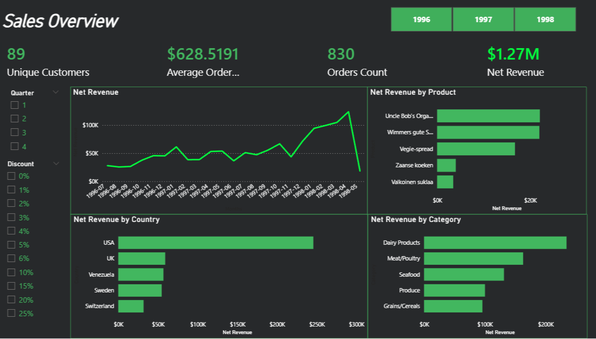
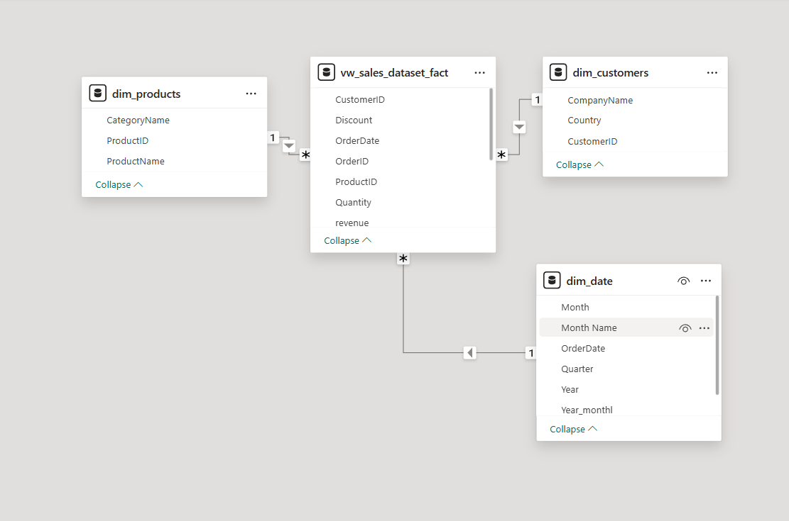

# powerbi-sales-dashboard
Power BI Sales Performance Dashboard using Northwind dataset
## Project Overview
This project presents an interactive Sales Performance Dashboard built in Power BI using the Northwind dataset.

The dashboard focuses on analyzing revenue, customer activity, product performance and sales trends across time and geography.

## Key Features
- KPI tracking (Revenue, Orders, Customers, Average Order Value)
- Product and category performance analysis
- Geographic sales analysis
- Time-based trend analysis
- Interactive filters and slicers

## Data Preparation
- Extracted dataset using SQL from Northwind database
- Performed data transformations in Power Query
- Built star schema data model (fact + dimension tables)
- Created DAX measures for business metrics

## Tools
- Power BI
- SQL
- Power Query
- DAX
- Data Modeling

## Dashboard Preview

## Data Model

